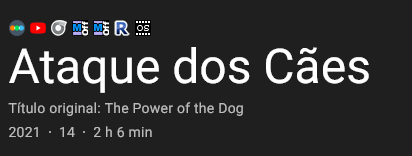

# Script IMDb-Links 1.4v

## Sobre

Criado para aprendizagem em JavaScript, com a intenção em deixar automatizado a pesquisa de filmes em outros meios.

### Ferramentas

- [x] VSCode
- [x] JavaScript
- [x] Exensão Tampermonkey

### Tutorial

> Claro que sei que o código pode se reduzido, mas isso é para uma próxima versão

Um exemplo do Letterboxd
O modo mais simples é substituir o letterboxd por outro nome de site, deixando apenas o *I e *A que estão no final.

Para obter o link de pesquisa é só fazer alguma pesquisa em algum site e tudo aquilo que não for o que digitou e 
aparecer na barra de endereço é o link que irá adicionar no `{nomeDoSite}A.setAttribute('href', 'link${tituloCortado}..'}`
- tituloCortado para o título da página 4.
- pnameCB para id do imdb com *tt*
- Usando template string.
- Exemplo `https://www.rottentomatoes.com/search?search=titanic` - O que não for titanic irá no lugar do *link.

~~~JavaScript
//Letterboxd
  const letterboxdI = document.createElement('IMG');
  const letterboxdA = document.createElement('a');

  letterboxdA.setAttribute("href", `https://letterboxd.com/search/films/${tituloCortado}`)
  letterboxdI.src = 'https://letterboxd.com/favicon.ico';
  letterboxdA.setAttribute('target', '_blank');
  letterboxdI.setAttribute('style', 'width:16px;');
  letterboxdA.appendChild(letterboxdI);
  paiLink.appendChild(letterboxdA);
 ~~~
